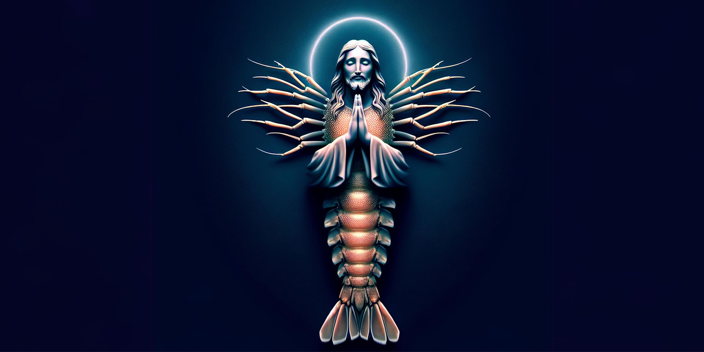

### Published in [The Conversation](https://https://theconversation.com/the-dead-internet-theory-makes-eerie-claims-about-an-ai-run-web-the-truth-is-more-sinister-229609)

If you search “shrimp Jesus” on Facebook, you might encounter dozens of images of artificial intelligence (AI) generated crustaceans meshed in various forms with a stereotypical image of Jesus Christ.

Some of these hyper-realistic images have garnered more than 20,000 likes and comments. So what exactly is going on here?

The “dead internet theory” has an explanation: AI and bot-generated content has surpassed the human-generated internet. But where did this idea come from, and does it have any basis in reality?
